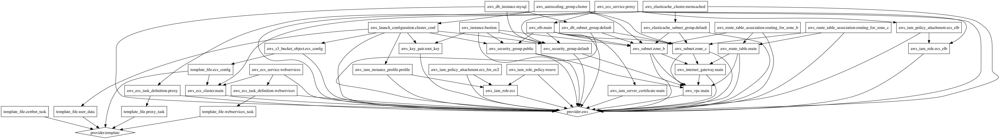

# Generic Infrastructure

*DevOps and all that Jazz*

This repo uses terraform to build a single environment that affords the following:

* Multi web app hosting (using docker)
* Scalable and configurable ec2 instances (using autoscaling groups / launch conf)
* proxy service to forward incoming requests to app containers (ecs, nginx)

## Pre-requisites

* *nix like environment (should work in windows too ;)
* terraform (https://www.terraform.io/downloads.html)
* environment vars:

```
export AWS_ACCESS_KEY_ID=XXXX   (e.g. talk to your aws account admin)
export AWS_SECRET_ACCESS_KEY=XXXX   (e.g. talk to your aws account admin)
export ENV=XXXX   (e.g. name of environment you want to launch: prod, dev, dave, peggy, stan etc ...)
```

## Make tasks

```
$ make          ## setup and sync your local state with remote s3 (call this before you make changes)
$ make plan     ## describe changes that will be made to the infrastructure
$ make apply    ## apply changes to the infrastructure
$ make destroy  ## !WARNING! completely destroy infrastructure
$ make graph    ## generate a confusing diagram of the infrastructure
$ make pull     ## pull / sync local state with s3
$ make push     ## push local state
$ make check    ## check environment variables
```

### Deployment flow

1. run ```make``` to reset and sync local state with remote
2. Make changes to templates in ```./tf/*.tf``` files
3. run ```make plan``` and verify you are happy with proposed changes if any
4. git commit and push
5. run ```make apply``` to apply changes to aws

## Confusing graph




## How it works

Read the terraform files ;)
